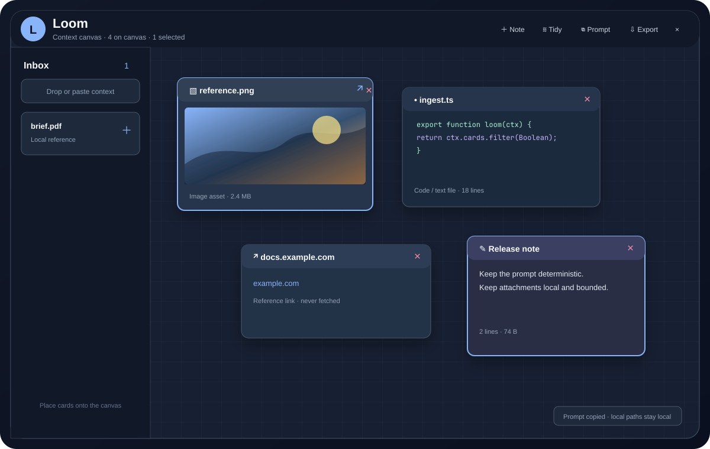

# Loom

Loom is a local-first context canvas for Omarchy. Drop files, images, links,
text, or notes onto a compact bar chip, arrange the useful material on a
private spatial board, then copy a deterministic agent prompt or export a
bounded local context bundle.

Loom is deliberately not a permanent screen-edge shelf. The chip lives in the
bar; its popup maps only while open and is anchored to the exact monitor and
bar position that opened it.



## Why Loom

Loom solved the cross-workspace drop problem with a right-edge shelf. Loom
keeps that proven intake path but adds a persistent board and explicit context
packaging. The board stores references and plain text locally; it never fetches
URLs, calls a model, uploads data, or records clipboard history.

## Install

The current repository URL is still `omarchy-loom`; its manifest installs the
plugin as `ef-code.loom`:

```bash
omarchy plugin add https://github.com/EF-Code/omarchy-loom.git --enable --yes
omarchy bar put ef-code.loom
omarchy-shell rescanPlugins
```

For a local checkout:

```bash
omarchy plugin validate .
mkdir -p ~/.config/omarchy/plugins/ef-code.loom
cp -a ./. ~/.config/omarchy/plugins/ef-code.loom/
omarchy-shell shell rescanPlugins
omarchy plugin enable ef-code.loom
omarchy bar put ef-code.loom
```

The bar widget defaults to the right section. Move it with the supported
Omarchy command, for example `omarchy bar move ef-code.loom --section left`.

## Interaction

| Action | Result |
| --- | --- |
| Click the Loom chip | Open or close the anchored canvas |
| Drop one or more files on the chip | Add quietly to the inbox |
| Hold a compatible drag over the chip | Spring-open Loom after 700 ms |
| Place an inbox card | Move it onto the spatial canvas |
| Drag a card title | Move the card without starting an external drag |
| Drag the `↗` handle | Start an explicit Wayland file/text drag |
| Ctrl-click cards | Toggle selection |
| Click empty canvas | Clear selection |
| Resize the corner handle | Resize within bounded dimensions |
| Add Note / Edit | Create and autosave a plain-text note |
| Tidy | Arrange selected cards, or all canvas cards, into a deterministic grid |
| Prompt | Copy selected cards, or all cards on the canvas, as Markdown |
| Export | Write `README.md`, `context.md`, `context.json`, and bounded attachments |

The inbox is a compact rail on a desktop popup and a drawer on narrow
displays. The canvas remains the dominant surface. The popup fits the active
output and works with top, bottom, left, and right bars.

## CLI and IPC

Install the CLI somewhere on `PATH`, if desired:

```bash
install -m 0755 bin/omarchy-loom ~/.local/bin/omarchy-loom
omarchy-loom add --no-show ./brief.pdf "https://example.com/spec"
omarchy-loom text $'Remember the Unicode-safe constraint\nwith two lines'
omarchy-loom list
omarchy-loom copy-prompt
omarchy-loom export
omarchy-loom show
```

The single custom IPC target is `ef-code.loom`:

```bash
omarchy-shell ef-code.loom ping
omarchy-shell ef-code.loom addQuiet '{"paths":["/tmp/a b.txt"]}'
omarchy-shell ef-code.loom list
omarchy-shell ef-code.loom copyPrompt
omarchy-shell ef-code.loom exportContext
```

Available methods are `open`, `close`, `show`, `hide`, `toggle`, `add`,
`addQuiet`, `stageText`, `stageUrl`, `list`, `count`, `clearInbox`,
`copyPrompt`, `exportContext`, `state`, and `ping`.

## State, migration, and privacy

Loom writes version 2 state atomically below
`<Quickshell.stateDir>/omarchy-loom/loom.json`. The exact state root follows
the session's XDG state configuration. Exports are created below the private
`<Quickshell.stateDir>/omarchy-loom/exports/` directory.

On first start, Loom reads the current `loom-state.json` beside the new state
location when no valid Loom state exists. Valid legacy cards are placed on a
deterministic canvas grid, the new state is written, and the legacy file is
left untouched. Loom never imports `bylund.loom` state.

Files and URLs are references. Text and notes are stored locally with bounded
size. Exports copy only eligible local files, cap each attachment at 20 MiB
and the total at 80 MiB, sanitize names, and never recurse into directories.
Missing `zip` leaves a valid directory export. No automatic URL request,
model API call, cloud sync, arbitrary shell command, package installation, or
sudo operation is part of Loom.

## Optional dependencies

Core intake, canvas work, prompt generation, and directory export use the
Omarchy/Qt runtime. `zip` is optional. Local file metadata uses `stat` and
`awk`; unavailable tools or files produce a visible status and do not break
the board. No dependency is installed automatically.

## Development and validation

```bash
node scripts/validate-plugin.mjs
node scripts/check-qml.mjs
node scripts/test-model.mjs
bash -n bin/omarchy-loom
shellcheck bin/omarchy-loom
qmllint -I "$OMARCHY_PATH/shell" qml/*.qml
QT_QPA_PLATFORM=offscreen /usr/lib/qt6/bin/qmltestrunner -input tests -import qml
omarchy plugin validate .
```

Run `quickshell -p qml/Preview.qml` for a local preview when a suitable shell
environment is available. The reproducible manual matrix is in
[`docs/testing.md`](docs/testing.md); real Wayland drag/drop and multi-monitor
checks cannot be replaced by offscreen rendering or IPC output.

## Removal

```bash
omarchy plugin remove ef-code.loom --yes
rm -f ~/.local/bin/omarchy-loom
```

If you also want to remove Loom-owned local data, remove only
`<Quickshell.stateDir>/omarchy-loom/` after exporting anything you need. Do
not remove `loom-state.json`, other plugin directories, or `shell.json`.

## Structure

```text
qml/BarWidget.qml          bar chip, model, lifecycle, IPC, persistence
qml/LoomPopup.qml          exact-size anchored layer surface
qml/LoomWorkspace.qml      inbox, canvas, selection, and responsive layout
qml/CanvasCard.qml         move, resize, note edit, selection, drag handle
qml/InboxCard.qml          dense intake card and placement actions
qml/ExportController.qml   bounded serialized directory/ZIP export
qml/LoomTheme.qml          guarded Omarchy theme roles
qml/utils.js               pure model, migration, prompt, and export helpers
bin/omarchy-loom            argv-safe CLI front end
```

## Attribution and license

The anchored popup and bar-widget interaction adapt patterns from Andreas
Bylund's MIT-licensed `omarchy-loom` at commit
``. See
[`THIRD_PARTY_NOTICES.md`](THIRD_PARTY_NOTICES.md). Loom is MIT licensed; see
[`LICENSE`](LICENSE).
